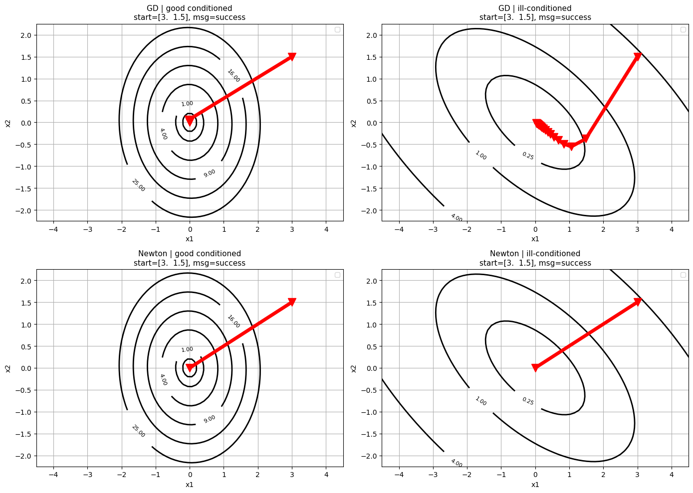
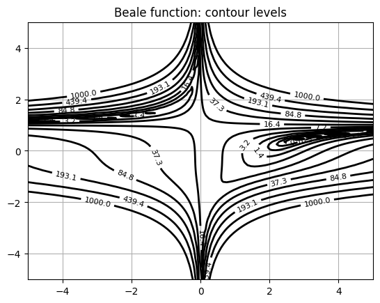
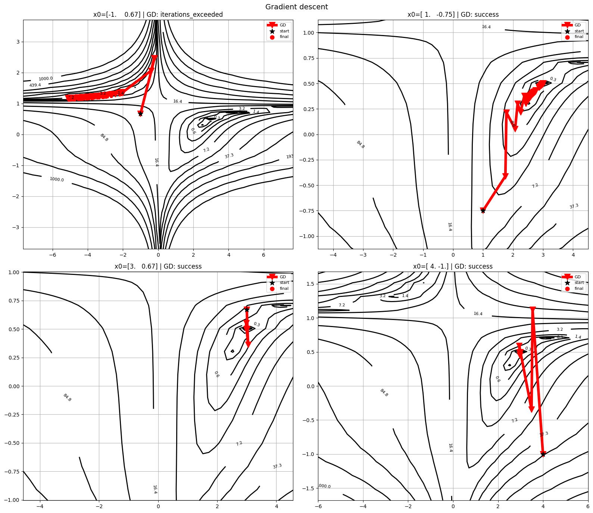
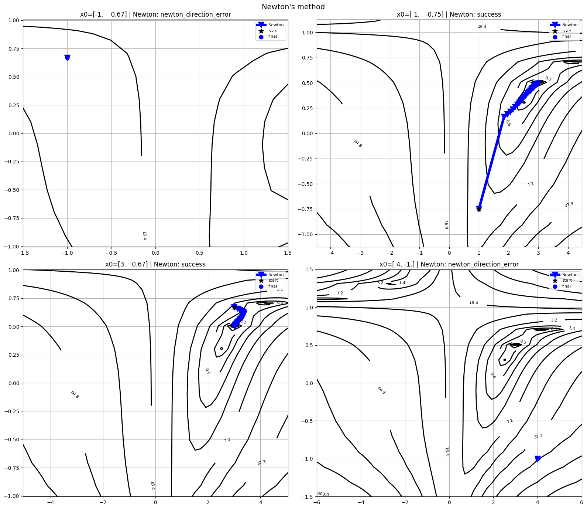
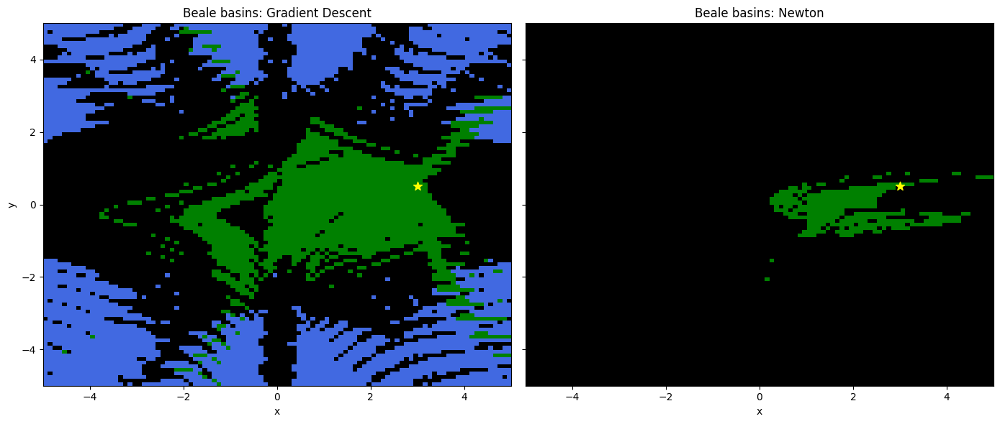

# Отчёт по заданию 3.2

## а) Постановка задачи

Работа состоит из двух частей.

Часть 1. Исследовано поведение градиентного спуска и метода Ньютона на выпуклых квадратичных функциях с разной обусловленностью: построены траектории на фоне линий уровня, сравнено число итераций и характер сходимости при выбранной в коде стратегии шага (поиск Армихо/Вольфа либо фиксированный шаг — как в репозитории лаборатории).

Часть 2. Для двумерной функции Била реализован оракул с аналитическим градиентом и гессианом; построены линии уровня на области с оврагами и глобальной структурой; из нескольких начальных точек сравнены траектории градиентного спуска и Ньютона; построена карта бассейнов притяжения (сетка стартов, цвет — итоговая окрестность сходимости, отдельно отмечены случаи несходимости). В отчёте зафиксированы сходимость к окрестности глобального минимума Била $(3,\,0.5)$ с $f^\ast=0$ и ограничения Ньютона при неположительно определённом гессиане.

Ниже приведена формулировка задания из методических материалов.

### 3.2.1 Часть 1. Квадратичные функции (анализ обусловленности)

Рассматривается $f(x)=\tfrac{1}{2}\langle Ax,x\rangle - \langle b,x\rangle$, $A \in \mathbb{S}^n_{++}$, $b \in \mathbb{R}^n$. В коде используется `QuadraticOracle` из `oracles`.

1. Две двумерные квадратики: хорошо обусловленная ($\kappa \approx 1$, уровни близки к окружностям) и плохо обусловленная ($\kappa \gg 1$, вытянутые эллипсы).
2. Градиентный спуск и Ньютон из одной и той же точки $x_0$.
3. Контуры уровней и наложенные траектории обоих методов.

### 3.2.2 Часть 2. Невыпуклая функция (сложная геометрия)

У квадратичной формы один глобальный минимум; далее — невыпуклая 2D-функция по варианту (в данной работе — Била). От начального приближения зависит, к какой стационарной точке $\nabla f = 0$ придёт итерационный процесс.

1. Оракул с аналитическими $\nabla f$ и $\nabla^2 f$.
2. Линии уровня на интервале, где видны овраги, седла и/или несколько минимумов (если есть).
3. Траектории из 3–4 разных $x_0$ (овраг, крутой склон, окрестность локального экстремума или седла).
4. Карта бассейнов: сетка стартов (в методичке — до $200\times 200$ на $[-5,5]^2$), запуск из каждой ячейки; цвет — тип исхода (минимум; при Химмельблау — до четырёх минимумов); чёрный — несходимость или аварийное завершение; отдельный цвет — седло или локальный максимум.

Для уровней применялись `plot_levels`, для траекторий — `plot_trajectory` из `plot_trajectory_2d.py`; карты — `plt.imshow` / `plt.pcolormesh`.

### 3.2.3 Вопросы для отчёта

1. Как отличается поведение градиентного спуска в зависимости от числа обусловленности $\kappa$ и стратегии выбора шага (константная, Армихо, Вульф)?
2. Как ведёт себя метод Ньютона на квадратичной функции по сравнению с градиентным спуском? За сколько итераций он сходится и почему?
3. Сошлись ли методы в один и тот же минимум на невыпуклой функции из разных стартовых точек? Встречалась ли ошибка разложения Холецкого / неположительно определённый гессиан (`LinAlgError` или `newton_direction_error` в коде) при Ньютоне? Если да — объяснить с точки зрения спектра матрицы Гессе, почему в этой точке классический Ньютон математически неприменим в исходном виде.
4. Почему градиентный спуск почти никогда не сходится к седловым точкам, даже если старт недалеко от них?
5. Почему «чистый» метод Ньютона (без модификации гессиана) может сходиться к седловым точкам или даже локальным максимумам? Как выглядят границы между бассейнами притяжения у Ньютона? Наблюдается ли «фрактальная» структура на границах (фракталы Ньютона)? (Дополнительно для трека с модификацией $H+\gamma I$: сравнить карту притяжения модифицированного Ньютона с исходной.)

#### Ответы

1. ГС, $\kappa$ и шаг. Пусть $f(x)=\tfrac{1}{2}x^\top Ax - b^\top x$, $A\succ 0$, $\mu=\lambda_{\min}(A)$, $L=\lambda_{\max}(A)$, $\kappa=L/\mu$. Рост $\kappa$ соответствует более вытянутым эллипсам уровня и узкому оврагу: градиент почти ортогонален направлению к минимуму, типичны зигзаги и рост числа итераций. На $L$-гладкой $\mu$-сильно выпуклой квадратике ГС с $\alpha\in(0,2/L)$ сходится линейно; при больших $\kappa$ коэффициент линейного убывания близок к единице.  
Постоянный шаг: условие $0<\alpha<2/L$; иначе возможна расходимость, при слишком малом $\alpha$ — медленная сходимость; на плохо обусловленных примерах узкий диапазон допустимых $\alpha$.  
Армихо: backtracking со спуском по $f$, устойчивость выше фиксированного шага без подбора, в узком овраге часто даёт мелкие шаги.  
Вульф: дополнительно ограничивает производную вдоль направления, шаги обычно крупнее, чем у «чистого» Армихо в тех же задачах; на квадратике часто быстрее одного лишь Армихо и стабильнее произвольной константы.  
В сумме: с ростом $\kappa$ ГС замедляется; константный шаг наименее гибкий, Армихо даёт гарантированный спуск, Вульф — компромисс скорости и устойчивости.

2. Ньютон на квадратике. $\nabla f(x)=Ax-b$, $\nabla^2 f(x)=A$. Уравнение $Ad_k=-(Ax_k-b)$ даёт $d_k=x^\ast-x_k$, $x^\ast=A^{-1}b$. При шаге $\alpha=1$: $x_{k+1}=x^\ast$ — одна итерация до решения (при точном решении системы). Модель второго порядка совпадает с $f$, поэтому плохая обусловленность уровней для Ньютона не проявляется так, как для ГС (линейная сходимость с фактором, зависящим от $\kappa$). Если в реализации стоит line search и он даёт $\alpha<1$, итераций может быть больше одной.

3. Била и ошибка направления. Из разных $x_0$ оба метода не обязаны приходить в один и тот же минимум или одну стационарную точку: бассейны различаются; Ньютон сильнее зависит от старта. Шаг в коде через разложение Холецкого для $H_k=\nabla^2 f(x_k)$ существует при симметричной положительно определённой $H_k$ ($\lambda_i(H_k)>0$). Если $\lambda_{\min}(H_k)\le 0$ (седло, область «вершины» рельефа), $H_k$ не SPD — в постановке минимизации классическое ньютоновское направление через $H_k^{-1}g_k$ некорректно; в программе это `LinAlgError` / `newton_direction_error`. По спектру $H_k$ виден знак кривизны вдоль главных направлений; $\lambda_i<0$ — направления с кривизной «вверх».

4. ГС и седла. В седле $\nabla f=0$, но есть $\lambda(H)<0$. Линеаризация $x_{k+1}=x_k-\alpha\nabla f(x_k)$ около седла: $x_{k+1}-x_s\approx (I-\alpha H_s)(x_k-x_s)$; для собственного вектора с $\lambda<0$ множитель $1-\alpha\lambda=1+\alpha|\lambda|>1$, малые отклонения по этому направлению растут. Седло — неустойчивая неподвижная точка отображения спуска; начальные данные на устойчивом многообразии седла образуют множество меры ноль, поэтому для типичных стартов итерации уходят из окрестности седла.

5. Ньютон, седла, бассейны. Классический Ньютон ищет корни $\nabla f(x)=0$, а не только минимумы; к любой невырожденной стационарной точке с обратимым $H$ траектория может сойтись. Границы бассейнов Ньютона на картах часто изломаннее, чем у ГС: направление сильно зависит от $H^{-1}g$, около почти вырожденного $H$ поведение резко меняется. На границах аттракторов на плоскости стартов иногда видна фракталоподобная структура (в литературе — «фракталы Ньютона»). Замена $H$ на $H+\gamma I$, $\gamma>0$, сдвигает спектр: $\lambda_i(H+\gamma I)=\lambda_i(H)+\gamma$, матрица SPD, реже срывы Холецкого и сходимость к не-минимальным стационарным точкам; картина бассейнов может стать глаже и ближе к картине ГС.

## б) Оптимизируемые функции, данные, оборудование, методы и параметры

### Функции

1. Квадратичная форма $f(x)=\frac{1}{2}x^\top A x - b^\top x$, $A\succ 0$. Взяты два варианта спектра $A$: малое $\kappa=\lambda_{\max}/\lambda_{\min}$ и большое $\kappa$. Матрица $A$ и вектор $b$ заданы синтетически (без датасетов).

2. Функция Била:  
   $f(x,y)=(1{,}5-x+xy)^2+(2{,}25-x+xy^2)^2+(2{,}625-x+xy^3)^2$.  
   Глобальный минимум $(3,\,0{,}5)$, $f^\ast=0$. Оракул считает $f$, $\nabla f$, $\nabla^2 f$ по формулам. Размерность $n=2$.

### Оборудование

16 ГБ ОЗУ, Intel Core i3, дискретная видеокарта не использовалась.

### Методы и параметры

- Градиентный спуск и метод Ньютона из модуля оптимизации курса.  
- Останов: относительное условие на $\|g_k\|^2$ к $\|g_0\|^2$ с $\varepsilon$ порядка $10^{-8}$–$10^{-10}$, плюс `max_iter` (для Била — порядка тысяч итераций у ГС и сотен у Ньютона, конкретные значения — в зафиксированном запуске ноутбука).  
- Линейный поиск: Вульф или Армихо с $c_1=10^{-4}$, для Вульфа $c_2=0.9$, стартовый $\alpha_0$; для Ньютона при необходимости уменьшался базовый $\alpha_0$ в линейном поиске, чтобы реже выходить на `computational_error` при срыве backtracking.  
- Бассейны: сетка на квадрате (в работе — как на рис. 5, типично $[-5,5]^2$), из каждой ячейки один прогон; цвет — класс исхода (окрестность $(3,0{,}5)$, иной минимум/стационарная точка, несходимость).

## в) Результаты эксперимента

### Выпуклая квадратичная функция

Рис. 1. Линии уровня и траектории ГС и Ньютона для хорошо и плохо обусловленной квадратики (четыре панели: два варианта $A$ и два метода / сценарий из ноутбука). Оси: $x_1$, $x_2$.

При малом $\kappa$ траектория ГС близка к прямой к минимуму; при большом $\kappa$ контуры вытянуты, у ГС зигзаги вдоль оврага и больше итераций. Ньютон при SPD-гессиане доходит до решения за малое число шагов; на плоскости траектория близка к отрезку к центру семейства эллипсов.

### Функция Била

Рис. 2. Уровни $f$ на выбранной области. Оси: $x$, $y$.

Рельеф невыпуклый; глобальный минимум у $(3,\,0{,}5)$; вытянутые участки влияют на выбор траектории.

Рис. 3. Траектории ГС из нескольких стартов на фоне уровней. Оси: $x_1$, $x_2$; на графике отмечены старт и конец итераций.

В зависимости от $x_0$ конечная точка оказывается в окрестности глобального минимума или алгоритм останавливается по относительному критерию по градиенту при ещё заметном $f$; сопоставление — по полю «message»/статусу в выводе оптимизатора и по значению $f$ в конечной точке.

Рис. 4. Траектории Ньютона для того же набора стартов.

Фиксировались остановки с `newton_direction_error` (гессиан не PD, разложение Холецкого не строится) и случаи срыва линейного поиска; по сравнению с выпуклой квадратикой поведение менее предсказуемо.

Рис. 5. Карта бассейнов: из каждой ячейки сетки — запуск метода; цвет — класс исхода (окрестность $(3,\,0{,}5)$, иной исход, несходимость). По подписям на файле рисунка — ГС и/или Ньютон.

Оси соответствуют координатам старта; расшифровка классов — по легенде на рисунке. Карта показывает разбиение плоскости $x_0$ по итогу прогона при зафиксированных параметрах метода.

## г) Выводы и связь с теорией

1. Квадратичная задача. Скорость ГС на $\mu$-сильно выпуклых $L$-гладких функциях теоретически ограничена $\kappa=L/\mu$; при больших $\kappa$ длинные почти ортогональные к направлению к минимуму участки траектории. Ньютон с точным гессианом на строго выпуклой квадратике за один полный шаг даёт решение — на чертеже это согласуется с короткой почти прямой траекторией к центру эллипсов; это частный случай интерпретации Ньютона как метода второго порядка, подбирающего локальный масштаб через $H^{-1}$.

2. Била. Глобально невыпуклая функция с различными локальными режимами (овраги, пологие зоны); бассейны притяжения одного и того же метода для разных стартов не совпадают. В эксперименте ГС с линейным поиском обходился без систематического обращения к разложению Холецкого; Ньютон чаще сталкивался с неопределённым гессианом и с необходимостью мелких шагов.

3. Относительный критерий останова. Условие $\|g_k\|^2 \le \varepsilon \|g_0\|^2$ при большой $\|g_0\|$ допускает остаточную норму градиента, существенную в абсолютном масштабе, поэтому статус успешного завершения в логе не всегда совпадает с малой величиной $f$ относительно $f^\ast$. При построении бассейнов и текстовых выводов дополнительно использовались $f(x_{\mathrm{end}})$ и расстояние до $(3,0{,}5)$.

4. Ньютон и полный шаг. В окрестности решения на выпуклых задачах с SPD-гессианом шаг $\alpha=1$ часто удовлетворяет условиям Вольфа/Армихо и даёт квадратичную сходимость по норме градиента; на Била вдали от минимума направление и величина шага нередко мешают быстрому входу в эту фазу — согласуется с локальной, а не глобальной сходимостью классического Ньютона.
