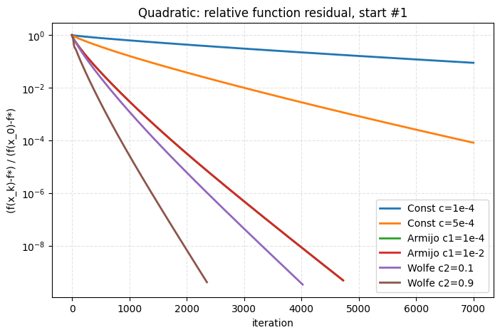
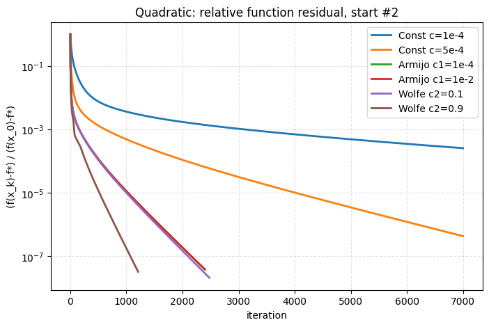
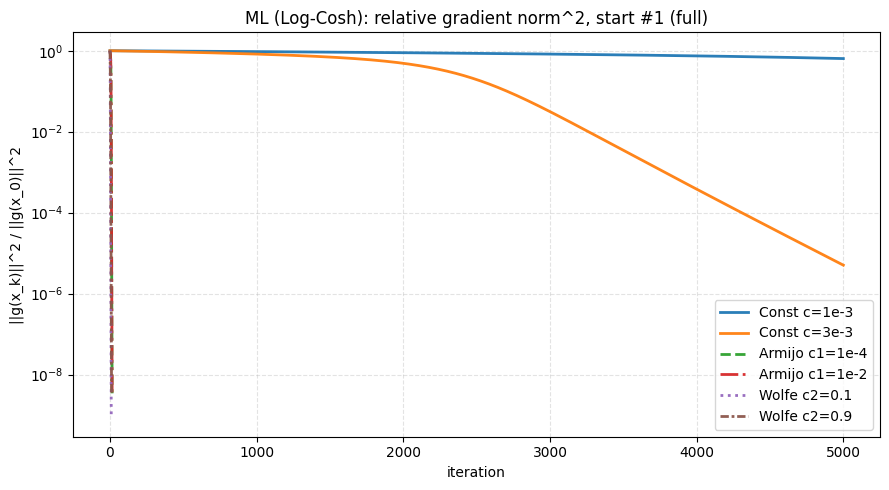
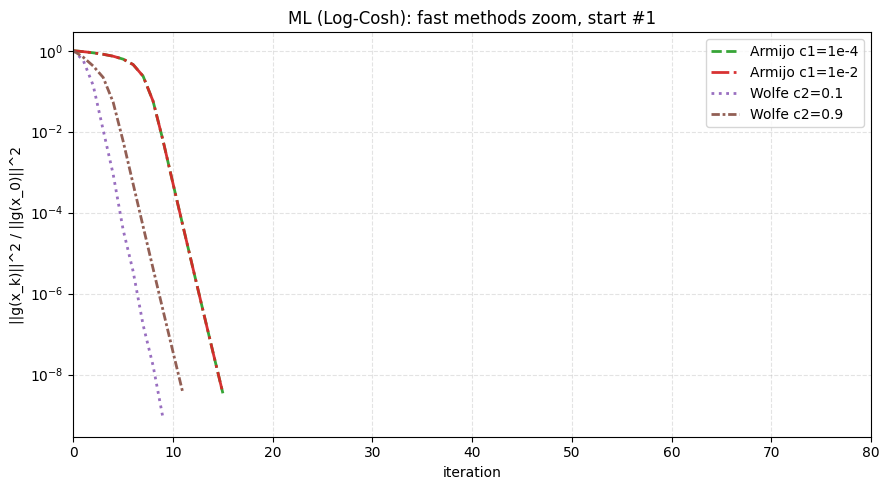
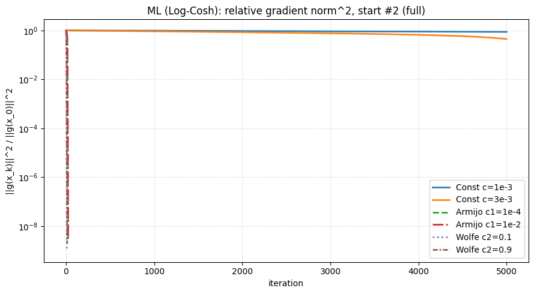
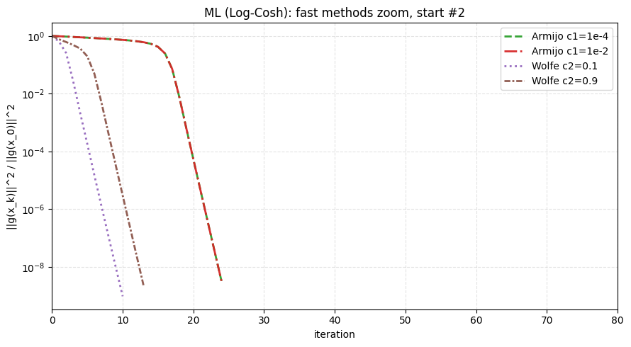

# Отчёт по заданию 3.5

## а) Постановка задачи

Исследовано влияние стратегии выбора длины шага в градиентном спуске на скорость и устойчивость сходимости. Сравнивались:

- константный шаг (`Constant`) при нескольких значениях шага;
- бэктрэкинг по правилу Армихо (`Armijo`) при разных $c_1$;
- линейный поиск по условиям Вольфа (`Wolfe`) при разных $c_2$ при фиксированном $c_1$.

Для каждой из двух постановок из одной и той же начальной точки (и для дополнительной второй точки) запускался один и тот же оптимизатор с разными опциями линейного поиска. Для квадратичной задачи на графиках — относительная невязка по значению функции в логарифмической шкале по итерациям; для ML-оракула — относительный квадрат нормы градиента $\|g_k\|^2/\|g_0\|^2$ в логарифмической шкале.

Ниже — формулировка из методических материалов (п. 3.5).

### 3.5 Эксперимент: стратегия выбора длины шага в градиентном спуске

Исследовать, как зависит поведение метода от стратегии подбора шага: константный шаг (попробовать различные значения), бэктрэкинг (попробовать различные константы $c_1$), условия Вульфа (попробовать различные параметры $c_2$). Рассмотреть квадратичную функцию и ML-модель варианта.

Запустить для этих функций градиентный спуск с разными стратегиями выбора шага из одной и той же начальной точки. Нарисовать кривые сходимости (для квадратичной — относительная невязка по функции в логарифмической шкале против числа итераций; для ML-оракула — относительный квадрат нормы градиента в логарифмической шкале против числа итераций) для разных стратегий на одном графике. Попробовать разные начальные точки.

### Вопрос задания: какая стратегия выбора шага самая лучшая?

#### Ответ

Универсально «лучшей» стратегии нет: она зависит от задачи (обусловленность, масштаб градиента), допустимого шага и критерия останова. В проведённых прогонах:

- на плохо обусловленной квадратике ($\kappa=10^3$, $n=40$) константные шаги $10^{-4}$ и $5\cdot 10^{-4}$ за отведённое число итераций не достигли заданной точности; Вольф с $c_2=0.9$ давал наименьшее число итераций до относительной невязки по $f$ порядка $10^{-8}$ для старта из нуля (таблично — ощутимо быстрее Армихо); для старта $x_0=\mathbf{1}$ быстрее других линейных стратегий оказался тот же Wolfe $c_2=0.9$ (по числу итераций до успешного останова по градиенту), тогда как константный шаг снова упёрся в лимит `max_iter`;
- на Log-Cosh + $L_2$ синтетическая постановка с выбранными малыми константными шагами не достигла порога $10^{-8}$ по относительному $\|g\|^2$ за `max_iter`; Армихо и Вольф сошлись; по числу итераций до этого порога чуть выигрывал Wolfe с $c_2=0.1$ по сравнению с $c_2=0.9$, разница порядка нескольких итераций.

Итог: в данных экспериментах адаптивный линейный поиск (Армихо или Вольф) существенно надёжнее и быстрее фиксированного шага при тех же начальных условиях; среди Вольфа выбор $c_2$ влияет на длину шага (более жёсткое условие на кривизну по лучу при меньшем $c_2$ иногда ускоряет выход на малый градиент в гладкой выпуклой ML-постановке).

## б) Оптимизируемые функции, данные, оборудование, методы и параметры

### Функции и данные

1. Квадратичная форма $f(x)=\frac12 x^\top A x - b^\top x$, $A\succ 0$. Размерность $n=40$; спектр задавался геометрической прогрессией собственных чисел от $1$ до $10^3$ (число обусловленности $\kappa=10^3$), ортогональное преобразование $Q$ из случайной матрицы (`np.random.seed(42)`), вектор $b$ — стандартный гауссов. Минимум $x^\ast=A^{-1}b$, на графике — отношение $(f(x_k)-f^\ast)/\bigl(f(x_0)-f^\ast\bigr)$.

2. Log-Cosh с $L_2$-регуляризацией (`LogCoshL2Oracle`): модель $y\approx Xw$, потери $\frac1m\sum_i \log\cosh\bigl((Xw-y)_i\bigr)+\frac{\lambda}{2}\|w\|^2$. Синтетика: $m=1200$, $n=40$, $X$, $w_{\mathrm{true}}$, шум $\mathcal{N}(0,\,0.2^2)$, $\lambda=10^{-2}$, тот же seed $42$.

### Оборудование

16 ГБ ОЗУ, Intel Core i3, дискретная видеокарта не использовалась.

### Методы и параметры

- Градиентный спуск из `src.optimization` с трассировкой истории.  
- Квадратичная задача: `tolerance=$10^{-10}$`, `max_iter=7000`. Стратегии: `Const` $c\in\{10^{-4},\,5\cdot 10^{-4}\}$; `Armijo` $c_1\in\{10^{-4},\,10^{-2}\}$, `alpha_0=1$; `Wolfe` $c_1=10^{-4}$, $c_2\in\{0.1,\,0.9\}$. Старты: $x_0=0$, $x_0=\mathbf{1}$.  
- ML: `tolerance=$10^{-8}$`, `max_iter=5000`. `Const` $c\in\{10^{-3},\,3\cdot 10^{-3}\}$; `Armijo` и `Wolfe` — те же типичные $c_1$, $c_2$; старты: $w_0=0$, $w_0=2\mathbf{1}$.  
- Графики сохранены в `figs/task_5/` (см. подписи к рисункам).

## в) Результаты эксперимента

### Квадратичная функция

Рис. 1. Относительная невязка $(f(x_k)-f^\ast)/(f(x_0)-f^\ast)$ в зависимости от итерации; старт $x_0=0$. Ось ординат — логарифмическая.

Для данных константных шагов кривые за 7000 итераций остаются выше порога; кривые Армихо и Вольфа монотонно убывают; Wolfe $c_2=0.9$ — наименьшее число итераций до успешного останова по градиенту среди сравниваемых методов (2352 против 4022 у Wolfe $c_2=0.1$ и 4728 у Армихо); относительная невязка по $f$ падает ниже $10^{-8}$ заметно раньше финального шага (в протоколе ноутбука — около 1955-й итерации).

Рис. 2. Те же стратегии, старт $x_0=\mathbf{1}$.

Паттерн тот же: константный шаг не укладывается в лимит итераций; наименьшее число итераций до `success` среди сходящихся — у Wolfe $c_2=0.9$ (1209 против 2479 у $c_2=0.1$ и $\approx 2400$ у Армихо).

### ML-оракул (Log-Cosh + $L_2$)

Рис. 3. Относительный квадрат нормы градиента, старт $w_0=0$, полный диапазон итераций.

Константные шаги практически не продвигаются к порогу по $\|g\|^2/\|g_0\|^2$; линейный поиск даёт быстрый спуск.

Рис. 4. Фрагмент по итерациям $0\ldots 80$ для стартов с адаптивным поиском (без константных кривых), старт $w_0=0$.

По достижению $\|g_k\|^2/\|g_0\|^2\le 10^{-8}$ первым оказывается Wolfe $c_2=0.1$ (9-я итерация против 11-й у $c_2=0.9$; Армихо — 15 шагов).

Рис. 5–6. Аналогично для старта $w_0=2\mathbf{1}$: полный график и укрупнение.

Для второго старта снова Wolfe $c_2=0.1$ быстрее доводит относительный квадрат нормы градиента до $10^{-8}$ (10 против 13 итераций у $c_2=0.9$, 24 у Армихо).

## г) Выводы и связь с теорией

1. Константный шаг на плохо обусловленной квадратике и на рассмотренной ML-задаче с выбранными значениями либо слишком консервативен (медленный прогресс), либо влек бы риск расходимости при завышении — без подбора под $L$ константная стратегия проигрывает адаптивной. Теория для $L$-гладкой выпуклой функции требует $\alpha<2/L$; на практике $L$ может быть велико и неизвестно.

2. Армихо гарантирует достаточное убывание по $f$ и устойчив, но дробление шага в овраге у квадратики здесь приводит к большему числу итераций, чем у Вольфа с «мягким» $c_2=0.9$.

3. Условия Вольфа добавляют контроль наклона вдоль направления спуска; при большем $c_2$ допускаются более длинные шаги, что на квадратике сократило число итераций. На гладкой выпуклой Log-Cosh+ridge постановке меньшее $c_2$ в эксперименте дало чуть более короткий путь до малого относительного градиента — согласуется с тем, что более жёсткое условие по кривизне может отсекать слишком длинные шаги и иногда лучше балансирует длину шага в начале.

4. Обобщая ответ на вопрос задания: оптимальная стратегия не одна; в работе надежнее всего оказались Армихо и Вольф; Вольф при настроенных $c_1$, $c_2$ давал наименьшее число итераций среди сравниваемых вариантов на обеих задачах, конкретный выбор $c_2$ зависел от постановки (квадратика — выигрыш $c_2=0.9$, Log-Cosh — небольшой выигрыш $c_2=0.1$).
