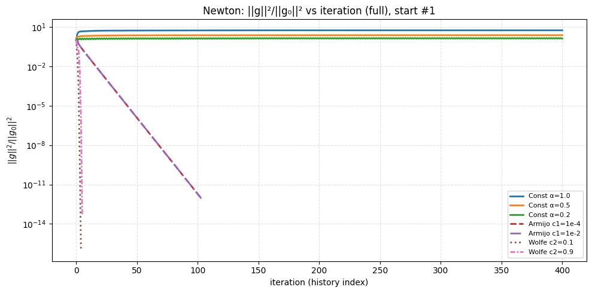
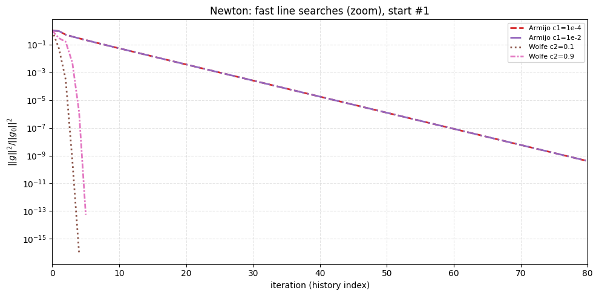
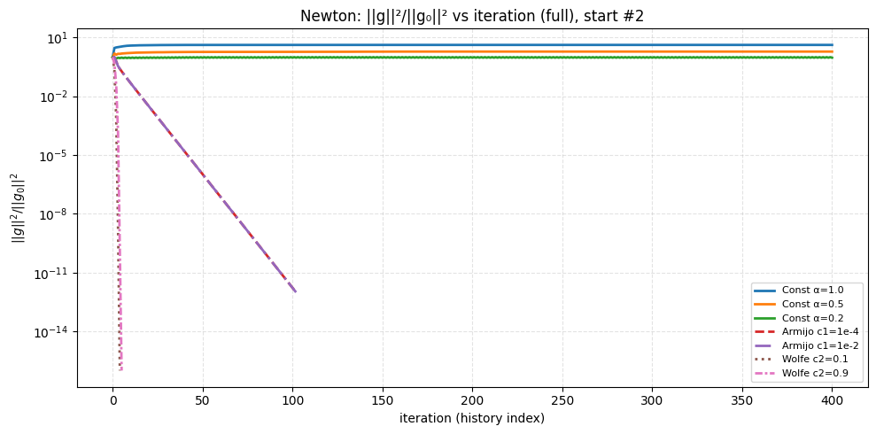
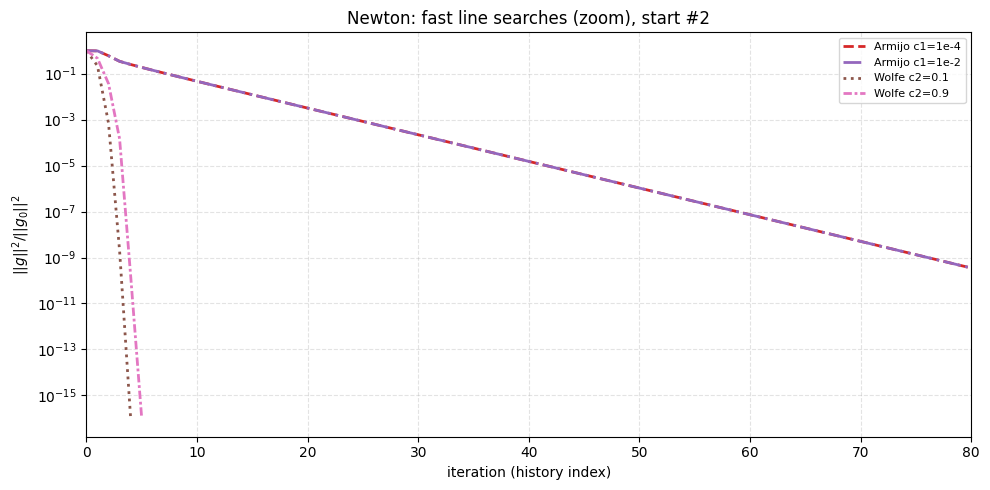
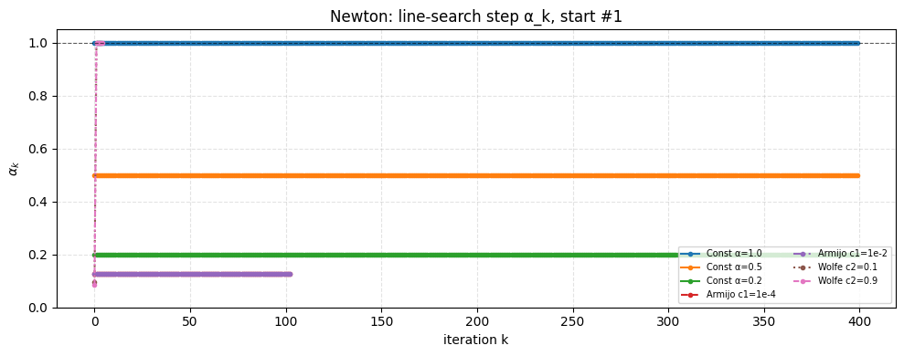

# Отчёт по заданию 3.6

## а) Постановка задачи

Повторён эксперимент по сравнению стратегий выбора шага (как в п. 3.5 для ML), но для метода Ньютона на той же постановке: оракул Log-Cosh с $L_2$-регуляризацией, синтетические данные. Сравнивались константный шаг, Армихо и Вольф с теми же типами настройки параметров. Для каждой стратегии строились кривые относительного квадрата нормы градиента $\|g_k\|^2/\|g_0\|^2$ в логарифмической шкале; дополнительно по истории `alpha` фиксировался индекс итерации, начиная с которого все последующие выбранные шаги совпадают с единицей (в пределах численного допуска), и значения $\|\nabla f\|$ до/после этого перехода.

Ниже — формулировка из методических материалов (п. 3.6).

### 3.6 Эксперимент: стратегия выбора длины шага в методе Ньютона

Повторить эксперимент 3.5 со сравнением стратегий выбора шага на ML-моделях варианта, но для метода Ньютона. Какая стратегия работает лучше всего? Почему для метода Ньютона единичный шаг является приоритетным? Зафиксировать момент, когда алгоритм входит в зону квадратичной сходимости (шаг $\alpha=1$ начинает приниматься всегда). Как меняется значение $\nabla f$ на этом этапе?

### Вопросы задания и ответы

Какая стратегия работает лучше всего? В выполненных прогонах наиболее экономичны по числу итераций до критерия останова стратегии Вольфа: около 4–5 итераций против $\approx 102$–103 у Армихо при одинаковых `max_iter` и допуске. Константный шаг $\alpha\in\{0.2,\,0.5,\,1\}$ не привёл к сходимости за 400 итераций (`iterations_exceeded`). Среди Вольфа с $c_1=10^{-4}$ вариант с $c_2=0.1$ слегка уменьшил число итераций относительно $c_2=0.9$.

Почему единичный шаг приоритетен? Ньютоновское направление $d_k$ построено так, что при полном шаге $\alpha=1$ следующая точка минимизирует квадратичную модель цели в $x_k$. В окрестности точки, где гессиан положительно определён и цель близка к этой модели, шаг $\alpha=1$ удовлетворяет условиям достаточного убывания и (сильным) Вольфа, после чего теоретически включается квадратичная сходимость по норме градиента. Линейный поиск с приоритетом пробовать $\alpha=1$ реализует именно эту «естественную» длину шага классического Ньютона.

Момент входа в зону $\alpha_k=1$ и поведение $\nabla f$. Для Вольфа индекс $k$, начиная с которого все последующие $\alpha$ равны 1, оказался равным 1 для старта $w_0=0$ и 2 для старта $w_0=2\mathbf{1}$. В протоколе ноутбука при первом «стабильном» полном шаге: для старта 1 и Wolfe $c_2=0.1$ норма градиента до шага $\approx 0{,}18$, после — $\approx 0{,}014$; для $c_2=0.9$ — $\approx 0{,}43$ и $\approx 0{,}32$. Для старта 2: $c_2=0{,}1$ — $\approx 0{,}024$ и $\approx 4\cdot 10^{-5}$; $c_2=0{,}9$ — $\approx 0{,}18$ и $\approx 0{,}011$. То есть на переходе к режиму постоянных единичных шагов норма градиента заметно падает; при более «удачной» комбинации параметров и старта снижение оказывается на порядки. У Армихо условие «все последующие $\alpha=1$» в данных прогонах не выполнилось (индекс в протоколе — `None`), что согласуется с более частым дроблением шага на фазе далеко от минимума.

---

## б) Оптимизируемые функции, данные, оборудование, методы и параметры

### Функция и данные

Log-Cosh с $L_2$-регуляризацией (`LogCoshL2Oracle`): $y \approx Xw$, целевая функция — среднее $\log\cosh$ невязок плюс $\frac{\lambda}{2}\|w\|^2$. Синтетика: $m=1200$, $n=40$, матрица $X$ и вектор истинных весов — гауссовы, шум отклика $\mathcal{N}(0,\,0.2^2)$, $\lambda=10^{-2}$, `np.random.seed(42)`.

### Оборудование

16 ГБ ОЗУ, Intel Core i3, дискретная видеокарта не использовалась.

### Методы и параметры

- Метод Ньютона из `src.optimization` (`newton`) с трассировкой истории и записью шагов `alpha` в историю.  
- Критерий останова: относительное условие на квадрат нормы градиента с `tolerance=$10^{-12}$` (в коде ноутбука), `max_iter=400`.  
- Стратегии линейного поиска: `Constant` с $c\in\{1.0,\,0.5,\,0.2\}$; `Armijo` с $c_1\in\{10^{-4},\,10^{-2}\}$, `alpha_0=1$; `Wolfe` с $c_1=10^{-4}$, $c_2\in\{0.1,\,0.9\}$.  
- Начальные точки: $w_0=0$ и $w_0=2\mathbf{1}$.  
- Графики сохранены в `figs/task_6/`.

---

## в) Результаты эксперимента

### Старт $w_0=0$

Рис. 1. Относительная величина $\|g_k\|^2/\|g_0\|^2$ по итерациям, все стратегии (полный диапазон).

Константный шаг за 400 итераций остаётся на «полке» — критерий не выполнен; при $\alpha=1$ с первой же итерации шаг формально единичный, но последовательность не попадает в малую окрестность решения. Армихо даёт монотонное убывание относительной нормы градиента, но за $\approx 103$ итерации. Кривые Вольфа падают за 4–5 итераций.

Рис. 2. Укрупнение: только стратегии без константного шага (Армихо и Вольф), ось $k$ ограничена (в ноутбуке — до 80 итераций или длины самой длинной из этих кривых).

Рис. 3. Выбранные линейным поиском длины шагов $\alpha_k$ по номеру итерации; горизонтальная линия на уровне 1.

У Вольфа после первой–второй итерации шаги стабилизируются у 1; у Армихо и части прогонов — колебания $\alpha_k$ ниже 1 на ранних итерациях.

### Старт $w_0=2\mathbf{1}$

Рис. 4–6. Аналогичная тройка графиков для второго старта.

Численно: снова `iterations_exceeded` у констант; Армихо $\approx 102$ итерации; Вольф 4–5 итераций. Индекс начала «все $\alpha=1$» у Вольфа сдвигается (в протоколе — с 1 до 2 для второго старта), что отражает более длинную начальную фазу до попадания в зону, где полный ньютоновский шаг допустим для правил Вольфа.

---

## г) Выводы и связь с теорией

1. На гладкой выпуклой (строго выпуклой за счёт ridge) задаче регрессии метод Ньютона с Вольфом сочетает быстрое уменьшение градиента с автоматическим переходом к полным шагам у решения, что согласуется с классической картиной локально квадратичной сходимости при SPD-гессиане.

2. Слепой константный шаг $\alpha=1$ не эквивалентен «правильному» Ньютону без глобализации: из удалённой точки полный шаг может ухудшить целевую функцию и не попасть в область притяжения метода — в эксперименте это проявилось ростом нормы градиента и отсутствием сходимости за фиксированный лимит итераций.

3. Армихо гарантирует спуск и устойчив, но избыточное дробление шага на удалённой фазе замедляет метод по сравнению с Вольфом, который согласован с кривизной вдоль ньютоновского направления и чаще допускает шаги, близкие к единице, уже после первых итераций.

4. На этапе, когда $\alpha_k\equiv 1$, норма градиента резко уменьшается (в численных примерах — вплоть до падения на порядки за один шаг), что соответствует ожидаемому поведению в зоне квадратичной сходимости классического Ньютона.

---
