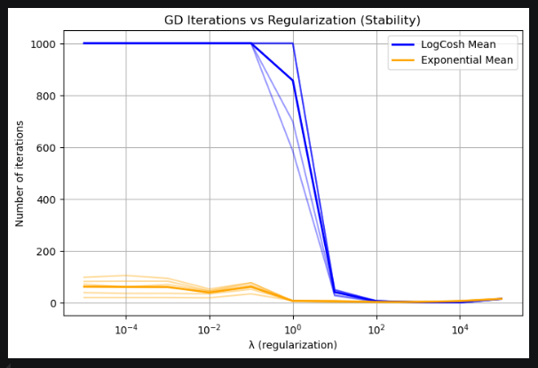
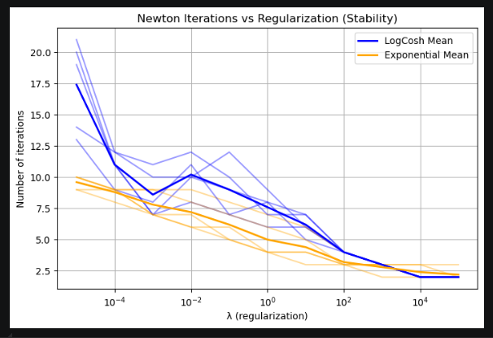
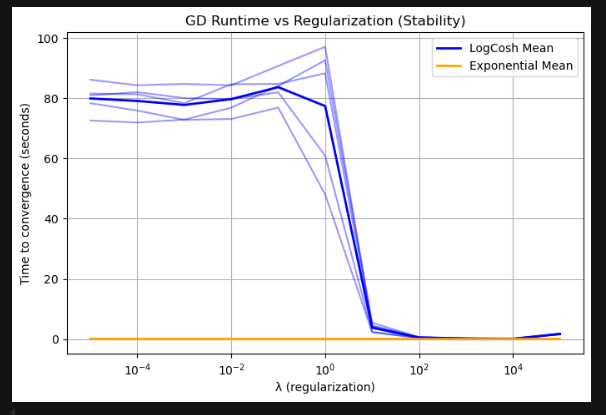
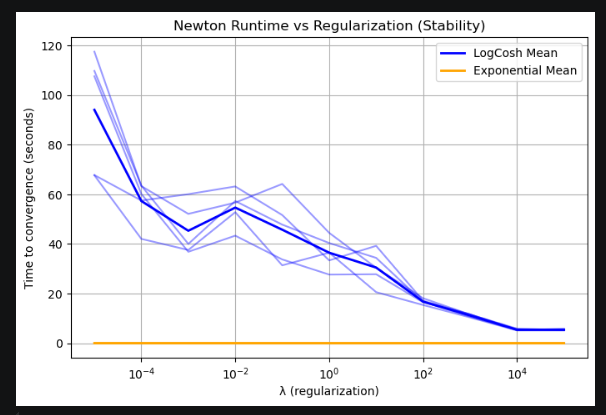
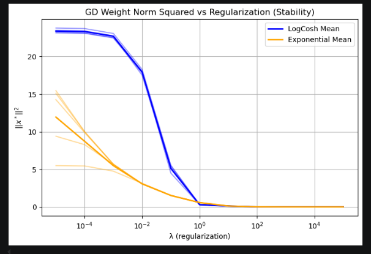
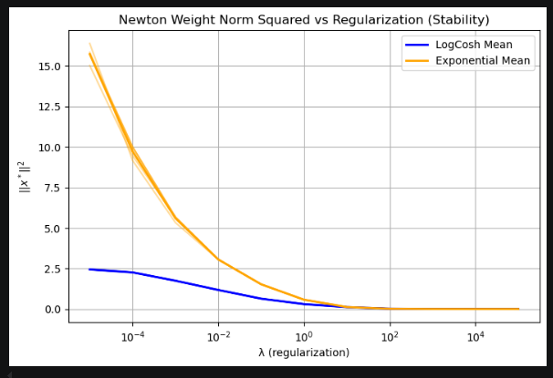

# Эксперимент 3.7
## Задача

Проанализировать зависимость кол-во итераций и время исполнений градиентного спуска и метода ньютона от коэффициента регулязации.

## Функции

Log-Cosh Loss

Exponential Loss

## Данные

bodyfat для Log-Cosh Loss и gisette для Exponential Loss, точка $x_0$ генерируется из стандартного нормального распределения.

Метод Ньютона работал слишком долго на gisette, поэтому кол-во параметров было случайным образом уменьшено до 1000

## Железо

CPU: Intel i5-12700H

## Метод

Градиентный спуск

max_iter=3000
eps=1e-8

Метод Ньютона

max_iter=30
eps=1e-8

## Графики

Кол-во итераций градиентного спуска в замисимости от $\lambda$

Кол-во итераций метода Ньютона в замисимости от $\lambda$

Время работы градиентного спуска в замисимости от $\lambda$

Время работы метода Ньютона в замисимости от $\lambda$

Норма отимальной точки в градиентном спуске в замисимости от $\lambda$

Норма отимальной точки в методе Ньютона в замисимости от $\lambda$

## Результаты
При стремлении $\lambda \to 0$, кол-во итераций увеличивается. Точнее при $\lambda \to +\inf$, кол-во итераций во всех эксперимантах стремиттся к нулю. Это потому, что при большой регуляции, функция становится похожа на квадратичную, причем с k = 1, а значит:
1) Градиентный спуск будет сходится крайне быстро
2) метод Ньютона бужет крайне быстро находить минимум, потому что модель параболы, которую он создает будет очень точна

Численная неустойчивость возникала при малый $\lambda$, но не сильная. При малых $\lambda$, траектории методов почти неизменяются, так что эти неустойчивости остались от методов.

При больших $\lambda$ у градиентного спуска явно видно плато. Это можно объяснить, во-первых, из-за того, что итераций и так уже мало, во вторых, функция приближается к идеальной: квадратичная с $k = 1$. У метода Ньютона нет плато, но если посмотреть внимательно, то можно увидеть, что при $\lambda = 1e5$ он сходится за 2 итерации (одна из них - начальная), т.е. он сразу находит минимум, а значит если увеличить $\lambds$, то мы увидим плато, просто потому меньше итераций просто не сделать

При увеличении $\lambda$, зона квадратичной сходимости растет, т.к. функция становится более обусловленной
