# Задача

Ислледовать эвристические модификации метода Ньютона

# Функции

Функция Билла

Exponential Loss

# Данные

gisette для Exponential Loss, точка $x_0 = 0_n$

Метод Ньютона работал слишком долго на gisette, поэтому кол-во параметров было случайным образом уменьшено до 1000

# Железо

CPU: Intel i5-12700H

# Метод

Метод Ньютона

# Результаты

Иногда shift метод находит оптимум, а spectral метод не находит.

Траектории из разных начальных точек. Функция Билла

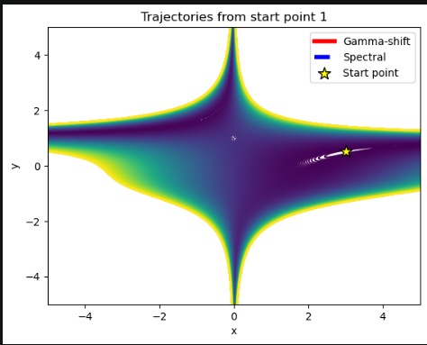
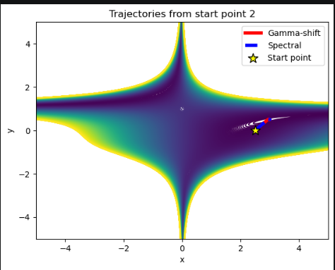
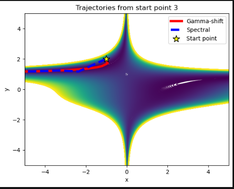
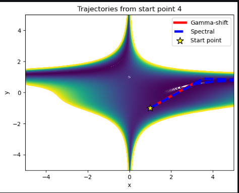
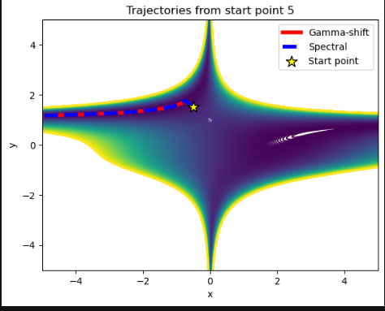
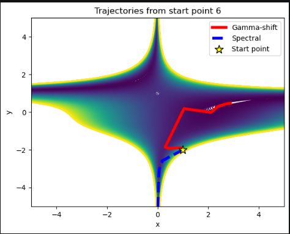
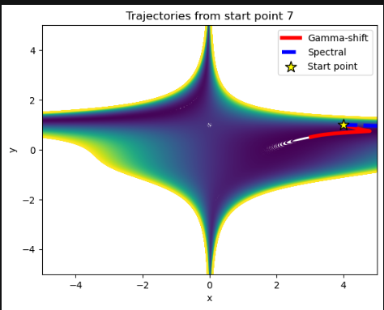
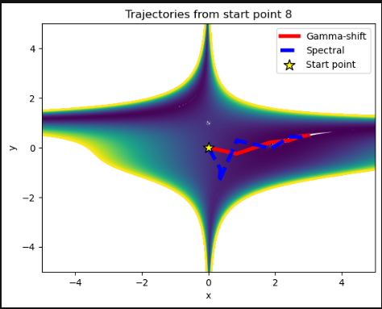
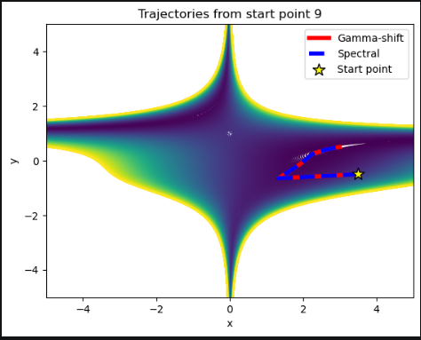
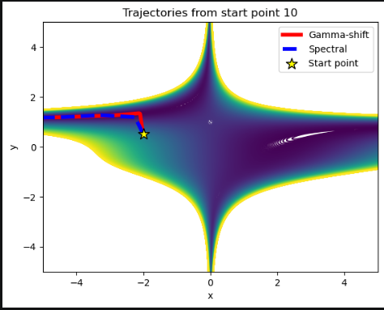

График изменения $\gamma$

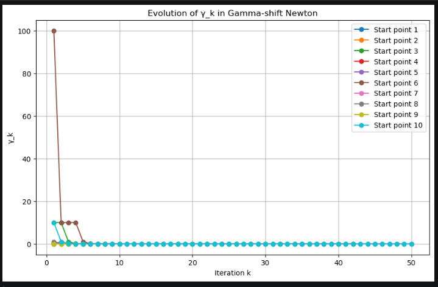

Можно увидеть, что оно очень быстро уменьшается

Вот геометрическое обоснование, что shift метод при большом $\gamma$ ведет себя как градиентный спуск, а спектральное усечение сохраняет "нью-
тоновское"поведение вдоль осей положительной кривизны.

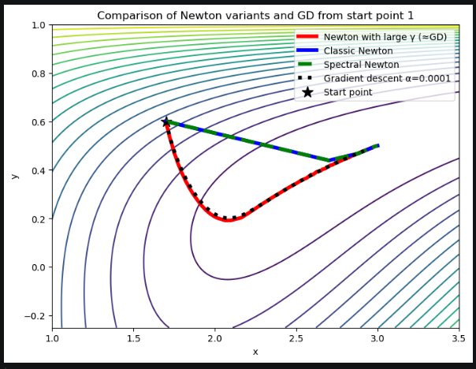
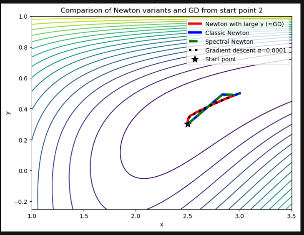
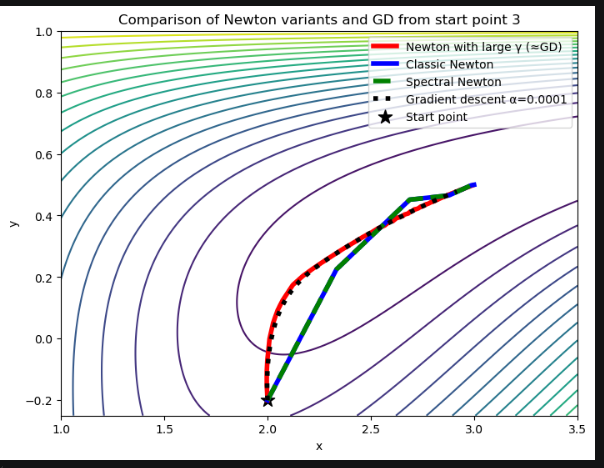
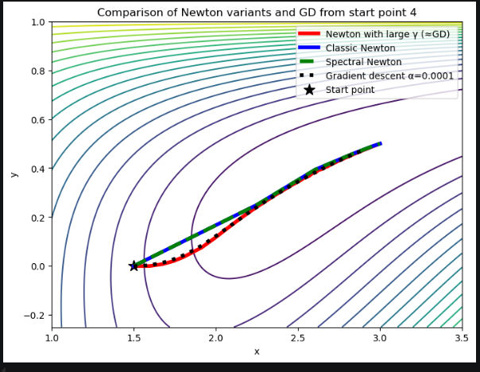

Вот сравнение скорости методов. ExponentialLoss, gisette

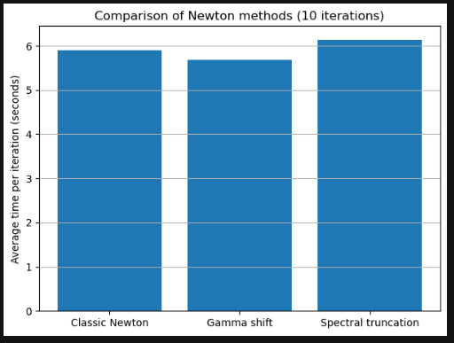

Методы работают примерно с такой же скоростью. Разве что shift метод немног быстрее, видимо, из-за более обусловленной матрицы 

