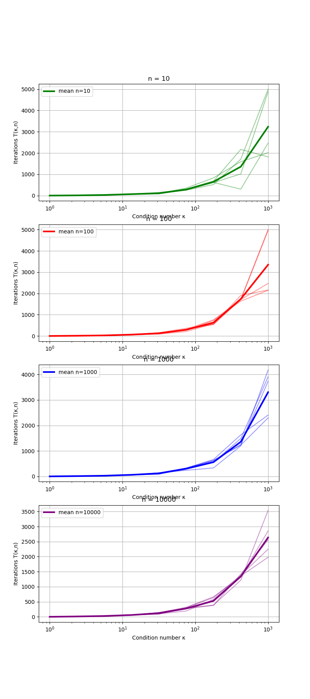
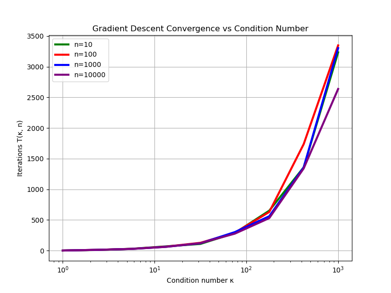

# Задача

Проанализировать зависимость кол-ва итераций градиентного спуска от обучловленности ($k$) и размерности ($n$) задачи.

# Функции

Квадратичная функция:

$f(x) = x^T A x - b^T x$

# Данные

Нет, точка $x_0$ генерируется из стандартного нормального распределения.

# Железо

CPU: Intel i5-12700H

# Метод

Градиентный спуск

tolerance = 1e-10  
max_iter = 5000

# Результаты

С ростом $k$, кол-во итераций растет линейно.

С ростом $n$, кол-во итераций не изменяется.

# Графики зависимости кол-ва итераций от $k$

Жирным отмечена среднее количество.

# Сравнение кол-ва итераций для разных $n$

# Оправдание

На лекции была формула

$f(x_k)-f_0 \leq (1 - \mu / L)^k (f(x_0) - f_0)$

для нашей функции

$\mu=\lambda_1=1$, $L=\lambda_n=k$

то $\lambda \to +\inf$, получаем, что скобка стремится к 1 и соответственно скорость становится очень медленной.